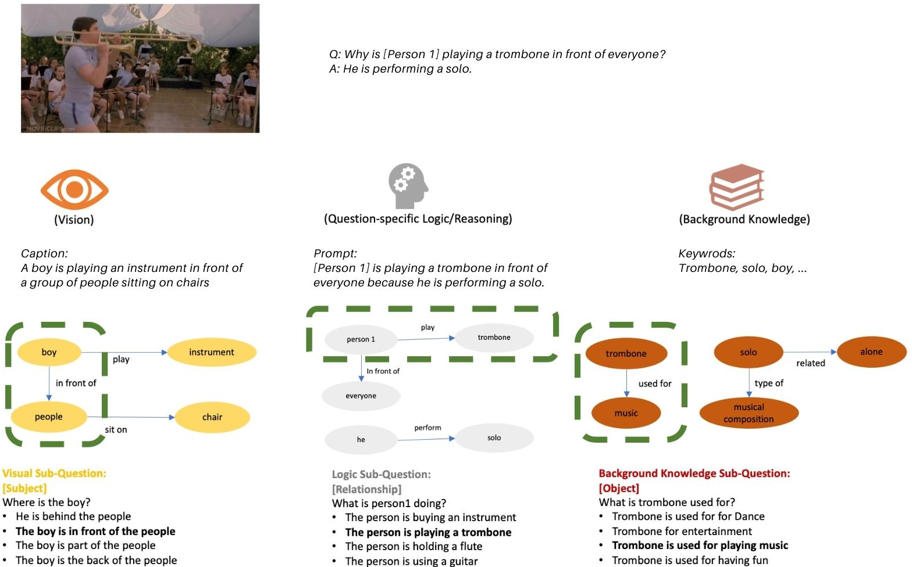

## Understanding ME? Multimodal Evaluation for Fine-grained Visual Commonsense

Zhecan Wang, Haoxuan You, Harold Liunian Li, Kai-Wei Chang, Shih-fu Chang

Columbia University

University of California, Los Angeles

### About 

 Visual commonsense understanding requires Vision-Language (VL) models to not only understand image and text but also cross-reference in-between to fully integrate and achieve comprehension of the visual scene described. Recently, various approaches have been developed and have achieved high performance on visual commonsense benchmarks. However, it is unclear whether the models really understand the visual scene and underlying commonsense knowledge due to limited evaluation data resources. 
 
To provide an in-depth analysis, we present a **Multimodal Evaluation (ME)** pipeline to automatically generate question-answer pairs to test models' understanding of the visual scene, text, and related knowledge. 

Currently, ME is built on top of Visual Commonsense Reasoning (VCR). For every original VCR image and question pair, ME provides three sub-questions from three perspectives: Vision, Question-related Logic and Background Knowledge.

### Examples of Data  
 
As shown in the example below, Q1 is the original VCR question and Q2, Q3 and Q4 are our sub-questions.

An example of VCR image: 

### Support or Contact
 
 If you are interested in downloading the data, please contact (olinzhecanwang[at][gmail][dot]com) for obtaining a data request form.
